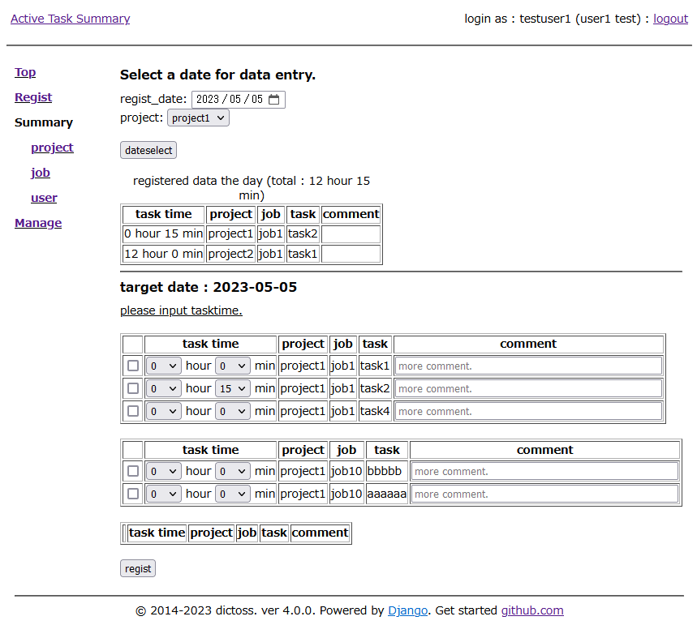

# active-task-summary

a web application of input and summary task time by team member.

# Current Stable Version

- 3.0.0 (use django-3.2, require python3.6+)
- 1.0.1 (use django-1.11, require python2.7)

# Develop Environment

## for 3.x series

- Debian GNU/Linux 11 (bullseye) amd64
- Django 3.2 series
- python 3.9.2
- apache 2.4
- python3-psycopg2 2.8.6
- postgresql-13

## for 1.x series

- Debian GNU/Linux 10 (buster) amd64
- Django 1.11.29
- python 2.7
- apache 2.4
- python-psycopg2 2.8.6
- postgresql-11

# NOTICE

This application used Django and must use postgresql.
(If you use sqlite3 or mysql, it is not work to GROUP BY.)

# ToDo

- management to master record.
- user permission and filter.
- brush up site design.

# Install

see docs/INSTALL.md file.

# Screenshot

