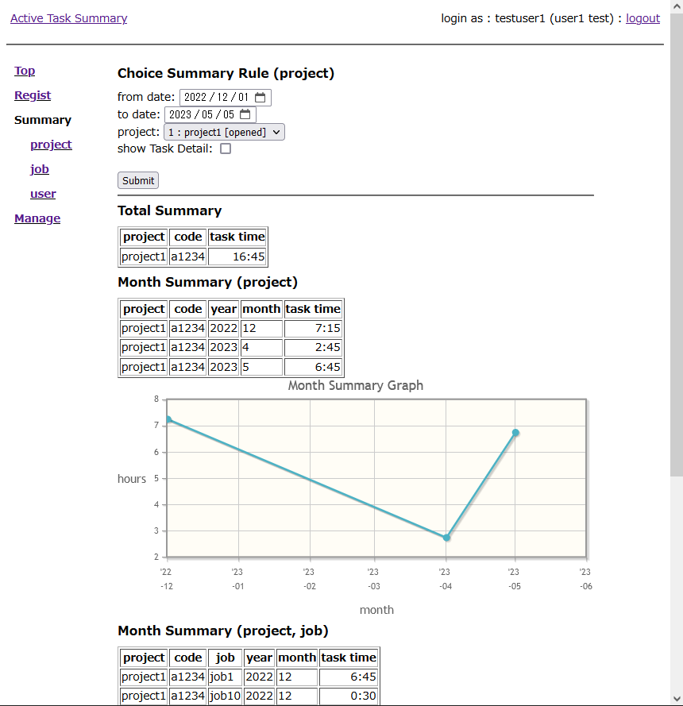

active-task-summary
===================
a web application of input and summary task time by team member.

Current Development Version
===================
0.8.x

Current Stable Version
===================
0.8.1 (recommend, python3 and Django-2.2+)
0.6.2 (for legacy system, use python 2.7 and Django-1.11)

Develop Environment
===================
- Debian GNU/Linux 10 (buster) amd64
- Django 1.11
- python 2.7.16 and 3.7.3
- apache 2.4
- python-psycopg2 and python3-psycopg2 2.8.6
- postgresql-9.6+ (from pgdg)

NOTICE
===================
This application used Django and must use postgresql.
(If you use sqlite3 or mysql, it is not work to GROUP BY.)

ToDo
===================
- management to master record.
- user permission and filter.
- brush up site design.

Install
===================
see docs/INSTALL.md file.

Screenshot
===================

